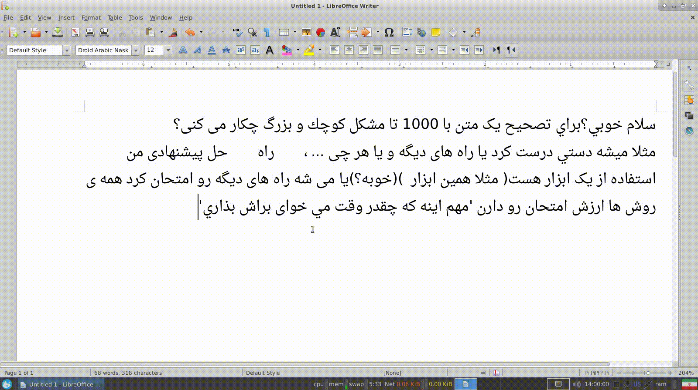

# Gnegar-libreoffice-macro
GNegar macro for LibreOffice (Persian grammar check)

Based on [GNegar](http://raminnietzsche.github.io/GuiNegar/) 

### Installation

You need installed libreoffice-script-provider-python:

```sh
$ sudo apt-get install libreoffice-script-provider-python
```

```sh
$ mkdir -p .config/libreoffice/4/user/Scripts/python
$ curl -o .config/libreoffice/4/user/Scripts/python/Gnegar.py https://raw.githubusercontent.com/RaminNietzsche/Gnegar-libreoffice-macro/master/Gnegar.py
```

### Usage



Feel free to fork it or do whatever you want with it. ;)


